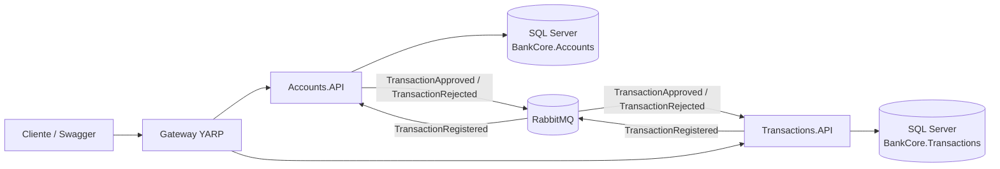
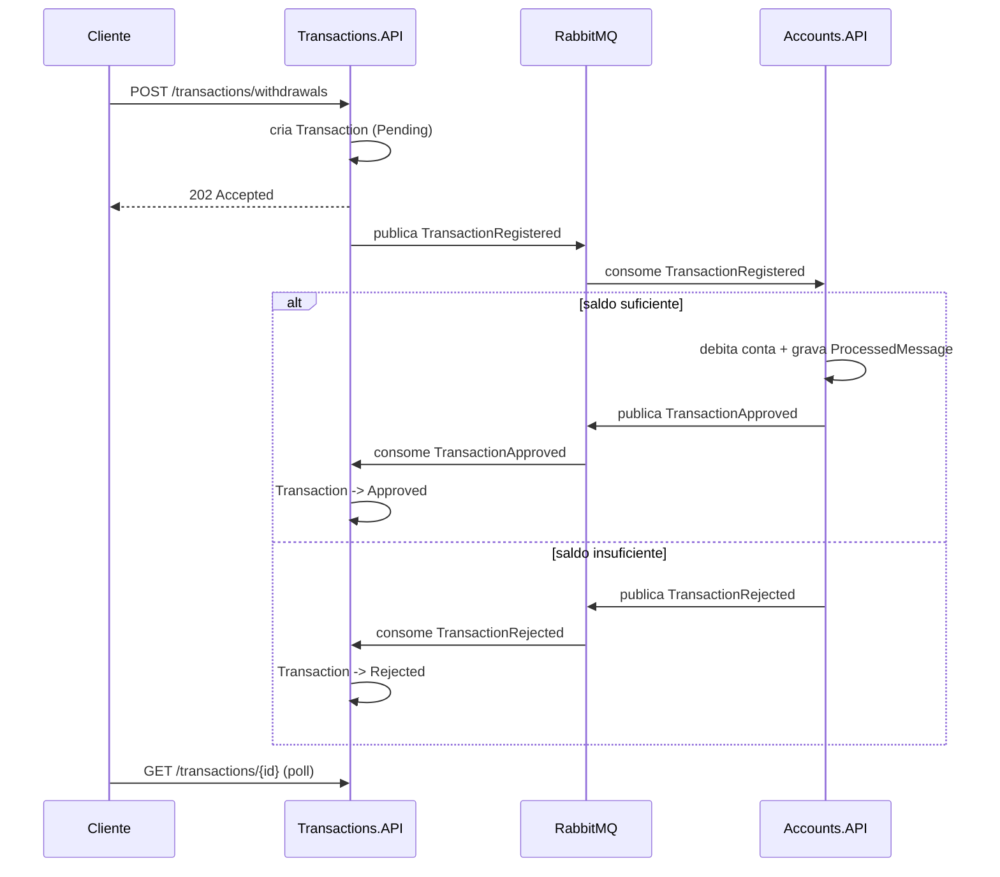

# BankCore

[](https://github.com/luciolimap/BankCore/actions/workflows/ci.yml)

Um núcleo bancário sendo modernizado de monólito para microsserviços — contas e transações desacopladas, comunicando-se por eventos, com consistência eventual e idempotência.

## O problema

Bancos tradicionais costumam ter um "core bancário" monolítico: uma aplicação única, um banco de dados compartilhado entre todos os módulos (contas, transações, cartões, clientes), lote noturno para consolidar saldos e um ciclo de deploy mensal, porque qualquer mudança arrisca quebrar o sistema inteiro.

Isso trava a evolução: um time não consegue evoluir "transações" sem coordenar com o time de "contas"; um bug em um módulo pode derrubar todos os outros; escalar horizontalmente significa escalar o monólito inteiro, mesmo que só uma parte esteja sob carga.

## A proposta

BankCore decompõe esse núcleo em dois microsserviços por capacidade de negócio:

- **Accounts** — dono do saldo e do cadastro de contas.
- **Transactions** — dono do registro de depósitos, saques e transferências.

Cada serviço tem seu próprio banco de dados (*database-per-service*) e só se comunica com o outro por contrato assíncrono (eventos), nunca acessando o banco alheio diretamente. Isso permite deploy, escala e evolução independentes — o objetivo real de uma modernização para microsserviços, não só "dividir o código em pastas diferentes".

## Arquitetura



Cada serviço segue uma Clean Architecture leve: `Domain` (regras de negócio puras) → `Application` (casos de uso) → `Infrastructure` (EF Core, MassTransit) → `API` (controllers, DI).

### Fluxo de uma transação (mini-saga coreografada)



O `202 Accepted` é intencional: a transação nasce `Pending` e o cliente consulta o status depois — essa é a materialização visível da consistência eventual entre os dois serviços.

## Stack

- .NET 9 / C# — ASP.NET Core Web API
- Entity Framework Core 9 (SQL Server em produção/Docker; SQLite como fallback de dev local)
- MassTransit 8 + RabbitMQ (mensageria assíncrona); transporte in-memory como fallback de dev local
- YARP (API Gateway)
- xUnit, FluentAssertions, MassTransit.Testing
- Docker / Docker Compose
- GitHub Actions (CI)

## Como rodar

### Opção 1 — Docker Compose (ambiente completo, recomendado)

```bash
docker compose up -d
```

| Serviço | URL |
|---|---|
| Gateway | http://localhost:8080 |
| Accounts API (Swagger) | http://localhost:8081/swagger |
| Transactions API (Swagger) | http://localhost:8082/swagger |
| RabbitMQ (management) | http://localhost:15672 (guest/guest) |

Smoke test (fluxo completo, incluindo o evento assíncrono real via RabbitMQ):

```bash
# lista as contas seed
curl http://localhost:8081/api/accounts

# faz um depósito (troque {accountId})
curl -X POST http://localhost:8082/api/transactions/deposits \
  -H "Content-Type: application/json" \
  -d '{"accountId":"{accountId}","amount":100}'

# consulta o status (Approved após alguns instantes)
curl http://localhost:8082/api/transactions/{transactionId}
```

### Opção 2 — Local sem Docker (desenvolvimento rápido)

Cada serviço roda isoladamente com `dotnet run`, usando SQLite e o transporte MassTransit in-memory (ambiente `Development`, já configurado em `appsettings.Development.json`).

```bash
dotnet run --project src/Accounts/BankCore.Accounts.API --urls http://localhost:5050
dotnet run --project src/Transactions/BankCore.Transactions.API --urls http://localhost:5060
dotnet run --project src/Gateway/BankCore.Gateway --urls http://localhost:5000
```

> **Importante:** o transporte in-memory do MassTransit é local ao processo. Como Accounts.API e Transactions.API rodam em processos separados, elas **não trocam eventos entre si** nesse modo — cada API funciona isoladamente via HTTP. O fluxo assíncrono real (evento cruzando serviços) é demonstrado por dois caminhos: os [testes automatizados do consumer](#testes) (que rodam os dois lados no mesmo processo de teste) e o `docker compose up`, onde o RabbitMQ real conecta os dois serviços.

## Endpoints

**Accounts.API**

| Verbo | Rota | Descrição |
|---|---|---|
| POST | `/api/accounts` | Abre uma conta |
| GET | `/api/accounts` | Lista contas |
| GET | `/api/accounts/{id}` | Detalhe da conta |
| GET | `/api/accounts/{id}/balance` | Saldo atual |

**Transactions.API**

| Verbo | Rota | Descrição |
|---|---|---|
| POST | `/api/transactions/deposits` | Registra um depósito (202 Accepted) |
| POST | `/api/transactions/withdrawals` | Registra um saque (202 Accepted) |
| POST | `/api/transactions/transfers` | Registra uma transferência (202 Accepted) |
| GET | `/api/transactions/{id}` | Status da transação |
| GET | `/api/transactions?accountId={id}` | Extrato de uma conta |

## Decisões de arquitetura (ADRs)

- [0001 — Fronteiras dos microsserviços](docs/adr/0001-microservices-boundaries.md)
- [0002 — Mensageria assíncrona com MassTransit](docs/adr/0002-async-messaging-masstransit.md)
- [0003 — Um banco de dados por serviço](docs/adr/0003-database-per-service.md)
- [0004 — Sem Outbox Pattern (ainda)](docs/adr/0004-no-outbox-yet.md)

## Consistência eventual e idempotência

- **Idempotência**: Accounts.API mantém uma tabela `ProcessedMessages` (chave = `TransactionId`). Antes de aplicar um `TransactionRegistered`, o consumer verifica se aquele `TransactionId` já foi processado — se sim, ignora. Isso protege contra reentrega de mensagens (at-least-once delivery), garantida por teste automatizado.
- **Compensação**: se o saldo for insuficiente (ou a conta não existir), o Accounts.API publica `TransactionRejected` em vez de lançar a exceção adiante — é a "perna de volta" da saga coreografada.
- **O que acontece se o Accounts.API cair?** As mensagens `TransactionRegistered` se acumulam na fila do RabbitMQ; nenhuma transação é perdida, só fica `Pending` até o serviço voltar e a fila ser drenada.
- **Sem timeout de saga**: uma transação pode, em teoria, ficar `Pending` para sempre se a mensagem se perder de forma irrecuperável. Um timeout/job de reconciliação é um próximo passo natural (ver Limitações).

## Testes

23 testes automatizados, cobrindo o que realmente importa em um domínio bancário:

- **Regras de negócio de domínio** (`Account`, `Transaction`): saldo insuficiente, valores inválidos, conta bloqueada, transições de estado inválidas.
- **O consumer `TransactionRegisteredConsumer`**, com `MassTransit.Testing`: aplica o débito/crédito e publica `TransactionApproved`; **ignora mensagem duplicada** (idempotência); publica `TransactionRejected` sem alterar o saldo quando não há fundos.

```bash
dotnet test
```

## Limitações conhecidas e roadmap

Registradas propositalmente — parte de saber o que falta é parte do trabalho de arquitetura:

- **Sem Outbox Pattern**: publicar o evento e salvar no banco não são atômicos hoje (ver [ADR 0004](docs/adr/0004-no-outbox-yet.md)); em caso de falha entre os dois passos, pode haver mensagem perdida ou duplicada além do que a idempotência cobre.
- **Sem autenticação/autorização** entre Gateway e serviços.
- **Sem observabilidade distribuída** (tracing, correlação de logs entre serviços).
- **Saga sem timeout**: uma transação pode ficar `Pending` indefinidamente se a mensagem de resposta se perder.
- **Sem CD**: o pipeline de CI builda e testa (incluindo as imagens Docker); publicar/implantar automaticamente é o próximo passo natural.

## Processo

Desenvolvido em sprints curtas, com board de issues no GitHub mapeando cada bloco de trabalho (fundação → domínio → mensageria → infraestrutura → testes → DevOps → documentação). Ver [Issues](https://github.com/luciolimap/BankCore/issues) e [Projects](https://github.com/luciolimap/BankCore/projects) do repositório.
